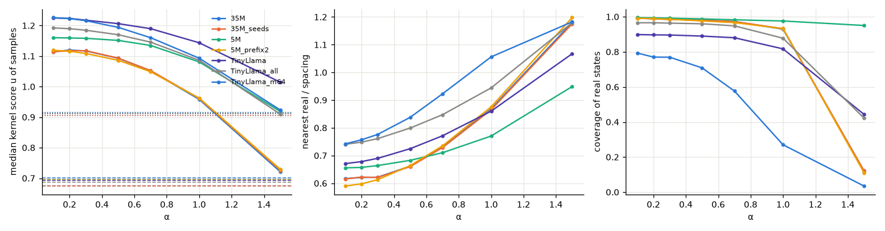
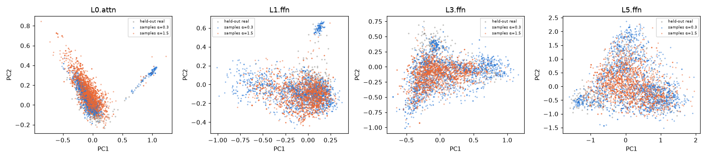

# gmanifold: sampling results

## TL;DR

Fit one decoder G: R^16 → R^D per residual location on the real token clouds of SimpleStories-5M, -35M and
TinyLlama-1.1B (prefix + every real token; also real story occurrences), then sample on the learned surface within
α × spacing of the observed states and validate against three independent checks with calibration bands.

* Samples are on-support for α ≤ 0.7 at every location of all three models (kernel score above held-out real states,
  tangent residual and nearest-real distance well inside the noise bands, coverage of the real cloud 0.97–0.99);
  α = 1 is marginal, α = 1.5 is off-support. Results are stable over seeds, latent dimension and prefixes.
* Pushed through the real model, the samples' images are scored like images of real held-out states by
  independently fitted destination manifolds.
* The sampler is uniform *within the tube around the observed states* (anchors equalised, clearly not the empirical
  token density), not in the manifold's own volume; the per-anchor rule that would fill sparse regions collapses.
* The fit is limited by the latent dimension, not by the network or the optimiser (63-fit capacity study); a VAE
  would be worse for this purpose.
* Two robustness rules matter: drop degenerate and isolated states first, and use the global support radius.
* Retracted negative: the TinyLlama embedding matrix looked "not chartable" (6 spacings) only because five hub
  tokens with tiny spacing dominate the per-anchor unit; in raw or global-median units it behaves like the small
  models (details in the last section). The library now detects such hub-dominated clouds.
* To the model itself, samples behave like blends of their nearest real tokens: their next-token distributions are
  closer to the nearest token's than real tokens are to each other (JS 0.21 vs 0.46 at α = 0.3; random-token baseline
  0.57), with top-1 agreement 32 % (random 6 %); one-spacing noise loses this (JS 0.51, agreement 8 %). Layer by layer,
  the images stay nearer to real states than held-out real images do and between the images of their two anchors.

## Summary

**Setup.** `GlobalManifold(latent_dim=16)` fitted per residual location on "prefix + every real token" clouds
(SimpleStories-5M: 13 locations, 3 seeds, m ∈ {8, 16, 32}; SimpleStories-35M: 25 locations, 5 seeds; TinyLlama-1.1B:
8 locations with 2 seeds and all 45 locations with one seed, 31,885 tokens after dropping 111 untrained byte-fallback
rows and 1 massive-activation outlier; plus a second prefix for the 5M model). Samples: 2000 per setting from 16,000 candidates, default `radius="global"`.

**What holds everywhere (all models, seeds, prefixes).**

1. *On-support regime.* Samples score above held-out real states (kernel u ≥ 1.03 at every location, coverage of the
   real cloud 0.97–0.99) for α ≤ 0.7; at α = 1.0 they still sit above the half-spacing noise band (u 0.96 vs 0.91)
   with coverage 0.93; α = 1.5 is off-support (u 0.72–0.74, coverage 0.12). Seed spread of u at α = 0.3 is ≤ 0.013.
   The independent tangent-chart residual agrees: samples 0.55–0.64 spacings from the nearest local chart for α ≤ 0.7
   (held-out real 0.82, half-spacing noise 0.95, one-spacing noise 1.24). The conservative tangent-chart sampler used
   as a cross-check gives u 0.97 and nearest-real 0.27 at α = 0.3: on-support but, by construction, hugging the anchors.
2. *Latent dimension.* m = 8 / 16 / 32 give held-out reconstruction 0.78 / 0.74 / 0.67 spacings and u 1.16 / 1.11 /
   1.06 at α = 0.3; larger m fits better but the volume weights spread more (ESS 5.5k / 3.4k / 1.5k of 16k).
3. *Volume reweighting works and is validated exactly* on a synthetic sheet with a known volume element
   (`tests/test_manifold.py`): with per-anchor radii the samples reproduce the volume-uniform target; with the global
   radius they lie between the data density and the target at small α and converge to the target as α grows.
4. *Global radius is the robust default.* With per-anchor radii (`radius="local"`) the union of balls is dominated
   by the sparsest anchors (ball volume ∝ ρ^m): on SimpleStories-5M `L5.ffn` the anchor participation ratio drops
   from 3546 to ~100 and coverage from 0.995 to 0.96; on TinyLlama a single massive-activation state took 100 % of
   the anchor mass and 99 % of the importance weight (ESS = 1), collapsing every sample onto it. Dropping isolated
   states (`outlier_mask`) and using the global radius removes the failure.
5. *Propagation.* Embedding samples pushed through the real model (`embed → L0.attn / L0.ffn / mid / last`) are
   scored by independently fitted destination manifolds like images of real held-out states (u within ±0.03 of
   the real images at every destination for α ≤ 0.5, ±0.2 at the first sub-layer where the map is near-identity
   and the samples' own overshoot carries over). Real states displaced by one spacing before propagation are
   healed by the network: u 0.71 after one sub-layer, ≥ 0.99 after six or more.
6. *Loss ablation* (5M, `embed` and `L5.ffn`, α = 0.3). Removing the local-distance term lowers u by 0.04–0.07 and
   raises the samples' reconstruction gap by 25–40 %; 3× longer training overfits (train recon 0.51 / 0.40 vs 0.67 /
   0.52, held-out recon worse, sample ESS 2.0k / 2.1k vs 4.9k / 6.8k, reconstruction gap ×3). Hidden width and the
   curvature term are neutral.

7. *Real-occurrence clouds* (20k random token occurrences from 2,500 stories, split by story; all contextual locations
   of SimpleStories-5M and 35M; §6 of the tables). Lower and token-clustered dimension (TwoNN 5–12), harder fits (held-out
   reconstruction 0.76–1.17 spacings vs 0.70–0.87 for prefix clouds) and softer calibration bands (one-spacing noise
   scores u 0.86 instead of 0.69). Samples nevertheless stay on-support at every location of both models for α ≤ 1 (u ≥ 1.01, above
   the 0.5× band), and their FFN images are scored by the independent destination fits like real held-out images
   (u 1.01–1.03 vs 1.00). Coverage is lower (0.65 at α = 0.3) only because 2000 samples are spread over 18k states.

8. *Decoder capacity study* (§7 of the tables; 63 fits on `embed`, `L2.ffn`, `L5.ffn`). At m = 16 no architecture or
   training variant changes the held-out reconstruction by more than 0.006 spacings: widths from (256, 128) to
   (2048, 1024), one to three hidden layers, learning rates 1e-3–5e-3, batches 128–2048, λ_geom 0.03–0.3 all give
   0.78–0.80 (`embed`), 0.72–0.74 (`L2.ffn`), 0.70–0.72 (`L5.ffn`); the two largest nets are worse (the 3.7M-parameter
   three-layer net under-fits in 300 epochs), and 600 epochs only lowers the training error (best validation epoch
   ≈ 300). The fit is therefore neither capacity- nor optimisation-limited. The one lever is the latent dimension:
   held-out reconstruction improves smoothly and without plateau from m = 8 to 64 (0.83 → 0.68, 0.77 → 0.57, 0.77 →
   0.49), which says the clouds have a long spectral tail rather than a sharp intrinsic dimension (local PCA needs
   21–27 components for 90–95 % of the neighbourhood variance). Larger m costs sampling efficiency: ESS at α = 0.3
   drops from 4.9k (m = 8) to 25–1200 (m = 64) and coverage from 0.99 to 0.81–0.90, while u moves from 1.15 toward
   1.03 (samples closer to the real states' own score). m = 16–24 is the practical compromise; m = 32 with more
   candidates if tighter reconstruction matters more than efficiency.

9. *Why not a VAE* (`experiments/vae_check.py`, `results/vae_check.json`; same architecture with a Gaussian encoder
   and β·KL, `embed` and `L5.ffn`). With β ≤ 1e-3 the posterior collapses to a point (σ ≈ 0.01–0.05), reconstruction
   equals ours, and decoding prior samples z ~ N(0, I) fails (u 0.05–0.16, coverage ≤ 0.15) because the aggregate
   posterior is nowhere near the prior; our Ω sampler on the posterior means works exactly as before. With β = 1e-2 the
   prior sampler becomes usable (u 1.2–1.3, coverage 0.98) at the price of reconstruction (0.79 → 0.86 at `embed`,
   0.71 → 0.80 at `L5.ffn`), of latent dimension (9 of 16 units stay active at `embed`) and of our sampler's ESS
   (415 / 126: the KL fights the local-distance term). The prior sampler also targets the aggregate-posterior (≈ data)
   density, not manifold volume, and has no notion of "near the observed support". Kept: nothing; noted as useful
   by-products: the number of active units as a data-driven m estimate, and the posterior σ as a per-point latent scale.

10. *What "volume-uniform" means on the real embedding cloud* (3940 SimpleStories-5M tokens, m = 16, 40k samples).
   Rank correlation between samples-per-real-anchor and the anchor's cell volume (∝ r_i^m): default sampler
   +0.005 (α = 0.5) / −0.004 (α = 1), data-density sampler −0.275, per-anchor-radius sampler +0.015 with 90 % of
   its samples on 1 % of the anchors and off-support (u 0.57). So the default sampler is uniform over the
   uniform-thickness tube Ω around the observed states (anchors equalised; clearly not the data density), but not
   uniform in the manifold's own volume, which would need the large cells of sparse regions to be filled — exactly
   what the per-anchor rule attempts and fails at. On the synthetic sheet the same effect appears as the global
   radius sitting between the data density and the exact volume target at small α.

11. *How the samples look to the model* (§8 of the tables, `experiments/downstream.py`). With an embedding sample at
   the last position of the prefix and the full 5M model run: the sample's next-token distribution is closer to that of
   its nearest real token (JS 0.21 at α = 0.3, 0.27 at 0.7, 0.37 at 1.5) than real tokens are to their own nearest
   neighbour (0.46) and far from a random token's (0.57); top-1 predictions agree with the nearest token's in 32 % of
   the samples (real-to-neighbour 19 %, random 6 %); entropy is slightly higher (3.4 vs 2.9 nats), as expected for a
   blend. Real tokens displaced by one spacing lose the neighbour relation (JS 0.51, top-1 agreement 8 %, entropy 3.9).
   Along the network the images of α ≤ 0.7 samples stay closer to real states than held-out real images do at every
   location (0.64–0.91 vs 0.89–0.96 spacings), keep u ≈ 1, and sit 0.5–0.9 spacings from the segment joining the
   images of their two nearest anchors (real 0.8–0.95, noise 1.1–1.3): they remain interpolations of their neighbours.

**What does not hold, and what we actually tried.** The one cloud that did not behave was the *embedding matrix* of
TinyLlama-1.1B (31,885 rows after dropping 111 shared byte-fallback rows and 1 massive-activation token; D = 2048).
What was run: `GlobalManifold` with hidden (512, 256), 150 epochs, m = 16 (two seeds) and m = 64 (one seed), 90/10
split by token, the same α sweep, plus the eight-location and all-45-location sweeps of the same model. What we saw
first: held-out reconstruction "6 spacings", samples "2.6 spacings from any real row", TwoNN ≈ 234 — and we called
the cloud not chartable. What was actually going on: five hub tokens (tight clusters of foreign-script junk tokens
such as `Архівовано`, `Webachiv`, `IABot`, spacing ≈ 0.1) are the nearest neighbour of 74 % of all held-out rows,
so "divide by the nearest anchor's spacing" divides by 0.1 for most points. In raw units the decoder reconstructs
held-out rows at 0.656 and training rows at 0.646, both ≈ the cloud's nearest-neighbour distance (0.678), the same
regime as the SimpleStories embeddings; in units of the global median spacing held-out real rows sit at 0.99
(recon 0.96), α = 0.3 samples at 0.46 (recon 0.09) and one-neighbour-distance noise at 1.40 (recon 1.38). The
library now detects hub-dominated clouds (median spacing of the anchors that points actually land on < half the
global median) and reports in global units; the TinyLlama tables were regenerated in those units. What remains
true: this cloud is high-dimensional (TwoNN 234 vs 19–24 for SimpleStories, MLE 32) and its coverage by 2000 samples
is lower (0.60 vs ≥ 0.97 elsewhere); with the corrected unit all four validators behave normally there (held-out real
0.99 / 0.95 / 1.00 / 0.98 on nearest / recon / u / tangent, one-spacing noise 1.40 / 1.39 / 0.68 / 1.40, samples at
α = 0.3 0.44 / 0.09 / 1.35 / 0.43). Not tried: m > 64, more than 150 epochs, frequent-token subsets, other preprocessing.
Use `intrinsic_dimension`, the held-out reconstruction and the reported hub share before trusting samples on a new cloud.

Point clouds: a fixed prefix followed by every real token, residual state at the last position, one cloud per residual location; 90 % of the tokens fit the manifold, 10 % are held out. All distances are in units of the local spacing (distance to the 8-th real neighbour); `u` is the Guidotti kernel score (1 on fitted states); bands = held-out real states and real states displaced by 0.5× / 1× their spacing. Samples: 2000 per setting, 8× candidates, volume reweighting.

## 0. Runs

| run | model | D | locations | states | time |
|---|---|---|---|---|---|
| 35M | SimpleStories/SimpleStories-35M | 512 | 25 | 3964 | 5 min |
| 35M_seeds | SimpleStories/SimpleStories-35M | 512 | 25 | 3964 | 8 min |
| 5M | SimpleStories/SimpleStories-5M | 256 | 13 | 3940 | 17 min |
| 5M_prefix2 | SimpleStories/SimpleStories-5M | 256 | 13 | 3940 | 6 min |
| TinyLlama | TinyLlama/TinyLlama-1.1B-Chat-v1.0 | 2048 | 8 | 31885 | 13 min |
| TinyLlama_all | TinyLlama/TinyLlama-1.1B-Chat-v1.0 | 2048 | 45 | 31885 | 34 min |
| TinyLlama_m64 | TinyLlama/TinyLlama-1.1B-Chat-v1.0 | 2048 | 5 | 31885 | 9 min |

## 1. Intrinsic dimension and fit quality per location

**35M** (SimpleStories/SimpleStories-35M)

| location | TwoNN | MLE | val recon m=16 |
|---|---|---|---|
| embed | 23.000 | 28.573 | 0.867 (rank 16) |
| L0.attn | 23.855 | 28.275 | 0.889 (rank 16) |
| L0.ffn | 15.243 | 27.655 | 0.801 (rank 16) |
| L1.attn | 15.390 | 27.768 | 0.806 (rank 16) |
| L1.ffn | 12.394 | 24.061 | 0.779 (rank 16) |
| L2.attn | 12.448 | 23.696 | 0.782 (rank 16) |
| L2.ffn | 11.188 | 20.273 | 0.768 (rank 16) |
| L3.attn | 10.997 | 20.091 | 0.765 (rank 16) |
| L3.ffn | 10.393 | 19.375 | 0.756 (rank 16) |
| L4.attn | 10.332 | 19.209 | 0.753 (rank 16) |
| L4.ffn | 10.035 | 18.590 | 0.743 (rank 16) |
| L5.attn | 9.900 | 18.511 | 0.741 (rank 16) |
| L5.ffn | 9.898 | 17.878 | 0.734 (rank 16) |
| L6.attn | 9.870 | 17.718 | 0.730 (rank 16) |
| L6.ffn | 10.133 | 17.067 | 0.724 (rank 16) |
| L7.attn | 9.956 | 16.577 | 0.721 (rank 16) |
| L7.ffn | 9.941 | 16.389 | 0.715 (rank 16) |
| L8.attn | 9.989 | 16.329 | 0.713 (rank 16) |
| L8.ffn | 9.950 | 16.504 | 0.714 (rank 16) |
| L9.attn | 9.688 | 16.281 | 0.714 (rank 16) |
| L9.ffn | 9.844 | 16.523 | 0.715 (rank 16) |
| L10.attn | 9.832 | 16.555 | 0.715 (rank 16) |
| L10.ffn | 10.124 | 16.779 | 0.717 (rank 16) |
| L11.attn | 10.139 | 16.805 | 0.714 (rank 16) |
| L11.ffn | 10.741 | 16.916 | 0.713 (rank 16) |

**35M_seeds** (SimpleStories/SimpleStories-35M)

| location | TwoNN | MLE | val recon m=16 |
|---|---|---|---|
| embed | 23.000 | 28.573 | 0.866 (rank 16) |
| L0.attn | 23.855 | 28.275 | 0.889 (rank 16) |
| L0.ffn | 15.243 | 27.655 | 0.804 (rank 16) |
| L1.attn | 15.390 | 27.768 | 0.806 (rank 16) |
| L1.ffn | 12.394 | 24.061 | 0.782 (rank 16) |
| L2.attn | 12.448 | 23.696 | 0.781 (rank 16) |
| L2.ffn | 11.188 | 20.273 | 0.767 (rank 16) |
| L3.attn | 10.997 | 20.091 | 0.767 (rank 16) |
| L3.ffn | 10.393 | 19.375 | 0.755 (rank 16) |
| L4.attn | 10.332 | 19.209 | 0.752 (rank 16) |
| L4.ffn | 10.035 | 18.590 | 0.739 (rank 16) |
| L5.attn | 9.900 | 18.511 | 0.740 (rank 16) |
| L5.ffn | 9.898 | 17.878 | 0.734 (rank 16) |
| L6.attn | 9.870 | 17.718 | 0.729 (rank 16) |
| L6.ffn | 10.133 | 17.067 | 0.726 (rank 16) |
| L7.attn | 9.956 | 16.577 | 0.718 (rank 16) |
| L7.ffn | 9.941 | 16.389 | 0.712 (rank 16) |
| L8.attn | 9.989 | 16.329 | 0.713 (rank 16) |
| L8.ffn | 9.950 | 16.504 | 0.715 (rank 16) |
| L9.attn | 9.688 | 16.281 | 0.711 (rank 16) |
| L9.ffn | 9.844 | 16.523 | 0.714 (rank 16) |
| L10.attn | 9.832 | 16.555 | 0.713 (rank 16) |
| L10.ffn | 10.124 | 16.779 | 0.717 (rank 16) |
| L11.attn | 10.139 | 16.805 | 0.715 (rank 16) |
| L11.ffn | 10.741 | 16.916 | 0.712 (rank 16) |

**5M** (SimpleStories/SimpleStories-5M)

| location | TwoNN | MLE | val recon m=8 | val recon m=16 | val recon m=32 |
|---|---|---|---|---|---|
| embed | 18.367 | 21.788 | 0.832 (rank 8) | 0.786 (rank 16) | 0.743 (rank 32) |
| L0.attn | 18.159 | 21.976 | 0.852 (rank 8) | 0.812 (rank 16) | 0.765 (rank 32) |
| L0.ffn | 14.250 | 18.821 | 0.783 (rank 8) | 0.750 (rank 16) | 0.703 (rank 32) |
| L1.attn | 14.342 | 18.790 | 0.783 (rank 8) | 0.747 (rank 16) | 0.703 (rank 32) |
| L1.ffn | 14.095 | 17.632 | 0.781 (rank 8) | 0.738 (rank 16) | 0.690 (rank 32) |
| L2.attn | 14.010 | 17.550 | 0.779 (rank 8) | 0.737 (rank 16) | 0.685 (rank 32) |
| L2.ffn | 13.163 | 16.629 | 0.771 (rank 8) | 0.725 (rank 16) | 0.664 (rank 32) |
| L3.attn | 13.147 | 16.373 | 0.773 (rank 8) | 0.722 (rank 16) | 0.660 (rank 32) |
| L3.ffn | 12.594 | 16.125 | 0.768 (rank 8) | 0.714 (rank 16) | 0.646 (rank 32) |
| L4.attn | 12.470 | 16.183 | 0.765 (rank 8) | 0.711 (rank 16) | 0.636 (rank 32) |
| L4.ffn | 12.731 | 16.964 | 0.776 (rank 8) | 0.715 (rank 16) | 0.637 (rank 32) |
| L5.attn | 12.667 | 16.941 | 0.767 (rank 8) | 0.705 (rank 16) | 0.620 (rank 32) |
| L5.ffn | 14.109 | 17.737 | 0.769 (rank 8) | 0.705 (rank 16) | 0.607 (rank 32) |

**5M_prefix2** (SimpleStories/SimpleStories-5M)

| location | TwoNN | MLE | val recon m=16 |
|---|---|---|---|
| embed | 18.367 | 21.788 | 0.785 (rank 16) |
| L0.attn | 18.433 | 21.762 | 0.798 (rank 16) |
| L0.ffn | 14.628 | 18.799 | 0.750 (rank 16) |
| L1.attn | 14.715 | 18.835 | 0.744 (rank 16) |
| L1.ffn | 14.619 | 17.816 | 0.732 (rank 16) |
| L2.attn | 14.605 | 17.825 | 0.735 (rank 16) |
| L2.ffn | 13.523 | 16.819 | 0.723 (rank 16) |
| L3.attn | 13.298 | 16.477 | 0.717 (rank 16) |
| L3.ffn | 12.991 | 16.204 | 0.707 (rank 16) |
| L4.attn | 12.902 | 16.273 | 0.706 (rank 16) |
| L4.ffn | 13.298 | 16.698 | 0.715 (rank 16) |
| L5.attn | 13.386 | 16.850 | 0.709 (rank 16) |
| L5.ffn | 14.251 | 17.093 | 0.705 (rank 16) |

**TinyLlama** (TinyLlama/TinyLlama-1.1B-Chat-v1.0)

| location | TwoNN | MLE | val recon m=16 |
|---|---|---|---|
| embed | 234 | 32.065 | 0.953 (rank 16) † |
| L0.attn | 94.784 | 37.765 | 0.930 (rank 16) † |
| L0.ffn | 18.079 | 31.489 | 0.976 (rank 16) |
| L3.ffn | 11.911 | 26.038 | 0.789 (rank 16) |
| L7.ffn | 10.327 | 22.550 | 0.764 (rank 16) |
| L11.ffn | 12.867 | 23.396 | 0.770 (rank 16) |
| L15.ffn | 8.481 | 16.980 | 0.774 (rank 16) |
| L21.ffn | 9.465 | 18.466 | 0.761 (rank 16) |

† hub-dominated cloud (a few anchors are the nearest neighbour of most points): distances in units of the global median spacing.

**TinyLlama_all** (TinyLlama/TinyLlama-1.1B-Chat-v1.0)

| location | TwoNN | MLE | val recon m=16 |
|---|---|---|---|
| embed | 234 | 32.065 | 0.953 (rank 16) † |
| L0.attn | 94.784 | 37.765 | 0.930 (rank 16) † |
| L0.ffn | 18.079 | 31.489 | 0.974 (rank 16) |
| L1.attn | 16.461 | 30.534 | 0.915 (rank 16) |
| L1.ffn | 14.716 | 27.207 | 0.838 (rank 16) |
| L2.attn | 15.036 | 27.849 | 0.825 (rank 16) |
| L2.ffn | 15.244 | 30.256 | 0.817 (rank 16) |
| L3.attn | 15.355 | 30.845 | 0.805 (rank 16) |
| L3.ffn | 11.911 | 26.038 | 0.790 (rank 16) |
| L4.attn | 12.464 | 27.062 | 0.786 (rank 16) |
| L4.ffn | 11.520 | 26.684 | 0.774 (rank 16) |
| L5.attn | 11.702 | 26.673 | 0.772 (rank 16) |
| L5.ffn | 11.076 | 25.488 | 0.769 (rank 16) |
| L6.attn | 11.231 | 26.003 | 0.766 (rank 16) |
| L6.ffn | 10.726 | 24.191 | 0.770 (rank 16) |
| L7.attn | 10.723 | 24.274 | 0.770 (rank 16) |
| L7.ffn | 10.327 | 22.550 | 0.764 (rank 16) |
| L8.attn | 10.442 | 22.710 | 0.763 (rank 16) |
| L8.ffn | 10.962 | 23.905 | 0.768 (rank 16) |
| L9.attn | 11.348 | 24.256 | 0.766 (rank 16) |
| L9.ffn | 11.070 | 23.240 | 0.768 (rank 16) |
| L10.attn | 11.267 | 23.263 | 0.766 (rank 16) |
| L10.ffn | 12.254 | 23.563 | 0.767 (rank 16) |
| L11.attn | 12.445 | 23.679 | 0.767 (rank 16) |
| L11.ffn | 12.867 | 23.396 | 0.770 (rank 16) |
| L12.attn | 12.944 | 23.486 | 0.769 (rank 16) |
| L12.ffn | 11.704 | 21.333 | 0.772 (rank 16) |
| L13.attn | 11.873 | 21.441 | 0.771 (rank 16) |
| L13.ffn | 11.177 | 19.719 | 0.764 (rank 16) |
| L14.attn | 11.114 | 19.563 | 0.760 (rank 16) |
| L14.ffn | 10.010 | 18.826 | 0.761 (rank 16) |
| L15.attn | 9.900 | 18.706 | 0.762 (rank 16) |
| L15.ffn | 8.481 | 16.980 | 0.774 (rank 16) |
| L16.attn | 8.591 | 17.081 | 0.774 (rank 16) |
| L16.ffn | 7.939 | 15.171 | 0.787 (rank 16) |
| L17.attn | 7.952 | 15.215 | 0.785 (rank 16) |
| L17.ffn | 7.916 | 15.268 | 0.786 (rank 16) |
| L18.attn | 7.962 | 15.259 | 0.784 (rank 16) |
| L18.ffn | 8.006 | 15.521 | 0.789 (rank 16) |
| L19.attn | 8.000 | 15.543 | 0.787 (rank 16) |
| L19.ffn | 8.126 | 16.240 | 0.789 (rank 16) |
| L20.attn | 8.118 | 16.247 | 0.784 (rank 16) |
| L20.ffn | 8.395 | 17.297 | 0.785 (rank 16) |
| L21.attn | 8.449 | 17.337 | 0.781 (rank 16) |
| L21.ffn | 9.465 | 18.466 | 0.761 (rank 16) |

† hub-dominated cloud (a few anchors are the nearest neighbour of most points): distances in units of the global median spacing.

**TinyLlama_m64** (TinyLlama/TinyLlama-1.1B-Chat-v1.0)

| location | TwoNN | MLE | val recon m=64 |
|---|---|---|---|
| embed | 234 | 32.065 | 0.934 (rank 64) † |
| L0.ffn | 18.079 | 31.489 | 0.934 (rank 64) |
| L3.ffn | 11.911 | 26.038 | 0.730 (rank 64) |
| L11.ffn | 12.867 | 23.396 | 0.658 (rank 64) |
| L21.ffn | 9.465 | 18.466 | 0.681 (rank 64) |

† hub-dominated cloud (a few anchors are the nearest neighbour of most points): distances in units of the global median spacing.

## 2. Samples versus α (mean over locations; bands in the last rows)

**35M**, m = 16

| α / band | nearest real | recon | tangent resid | u (mean) | u (min over loc) | coverage | ESS | ball multiplicity |
|---|---|---|---|---|---|---|---|---|
| 0.100 | 0.617 | 0.127 | 0.567 | 1.114 | 1.004 | 0.992 | 2724 | 1.088 |
| 0.200 | 0.621 | 0.130 | 0.571 | 1.120 | 1.009 | 0.989 | 2697 | 1.200 |
| 0.300 | 0.622 | 0.136 | 0.568 | 1.117 | 1.095 | 0.985 | 2638 | 1.278 |
| 0.500 | 0.662 | 0.169 | 0.596 | 1.093 | 1.069 | 0.980 | 2479 | 1.337 |
| 0.700 | 0.731 | 0.222 | 0.649 | 1.052 | 1.021 | 0.973 | 2283 | 1.322 |
| 1.000 | 0.868 | 0.344 | 0.761 | 0.958 | 0.922 | 0.929 | 1926 | 1.421 |
| 1.500 | 1.181 | 0.698 | 1.024 | 0.721 | 0.680 | 0.119 | 1288 | 1.866 |
| held-out real | 0.896 | 0.752 | 0.808 | 0.997 | 0.990 | – | – | – |
| real + 0.5x noise | 1.022 | 0.909 | 0.945 | 0.905 | 0.901 | – | – | – |
| real + 1x noise | 1.330 | 1.270 | 1.265 | 0.674 | 0.666 | – | – | – |

**35M_seeds**, m = 16

| α / band | nearest real | recon | tangent resid | u (mean) | u (min over loc) | coverage | ESS | ball multiplicity |
|---|---|---|---|---|---|---|---|---|
| 0.100 | 0.616 | 0.128 | 0.566 | 1.114 | 1.006 | 0.992 | 2817 | 1.073 |
| 0.200 | 0.622 | 0.130 | 0.571 | 1.118 | 1.015 | 0.989 | 2790 | 1.172 |
| 0.300 | 0.621 | 0.136 | 0.567 | 1.118 | 1.096 | 0.985 | 2732 | 1.234 |
| 0.500 | 0.660 | 0.168 | 0.595 | 1.093 | 1.071 | 0.980 | 2564 | 1.282 |
| 0.700 | 0.729 | 0.221 | 0.648 | 1.053 | 1.027 | 0.973 | 2338 | 1.310 |
| 1.000 | 0.865 | 0.339 | 0.758 | 0.961 | 0.923 | 0.932 | 1966 | 1.384 |
| 1.500 | 1.175 | 0.685 | 1.019 | 0.726 | 0.683 | 0.122 | 1324 | 1.881 |
| held-out real | 0.896 | 0.751 | 0.808 | 0.997 | 0.990 | – | – | – |
| real + 0.5x noise | 1.022 | 0.908 | 0.945 | 0.905 | 0.901 | – | – | – |
| real + 1x noise | 1.330 | 1.268 | 1.265 | 0.674 | 0.666 | – | – | – |

**5M**, m = 8

| α / band | nearest real | recon | tangent resid | u (mean) | u (min over loc) | coverage | ESS | ball multiplicity |
|---|---|---|---|---|---|---|---|---|
| 0.100 | 0.656 | 0.092 | 0.605 | 1.160 | 1.139 | 0.995 | 5757 | 1.017 |
| 0.200 | 0.657 | 0.093 | 0.606 | 1.159 | 1.136 | 0.994 | 5661 | 1.034 |
| 0.300 | 0.664 | 0.097 | 0.612 | 1.158 | 1.136 | 0.992 | 5536 | 1.047 |
| 0.500 | 0.683 | 0.108 | 0.625 | 1.151 | 1.129 | 0.988 | 5103 | 1.113 |
| 0.700 | 0.710 | 0.127 | 0.646 | 1.135 | 1.112 | 0.983 | 4222 | 1.244 |
| 1.000 | 0.770 | 0.184 | 0.697 | 1.081 | 1.049 | 0.976 | 2575 | 1.695 |
| 1.500 | 0.949 | 0.354 | 0.853 | 0.919 | 0.866 | 0.950 | 1106 | 3.039 |
| held-out real | 0.914 | 0.784 | 0.863 | 0.998 | 0.994 | – | – | – |
| real + 0.5x noise | 1.033 | 0.934 | 0.987 | 0.913 | 0.910 | – | – | – |
| real + 1x noise | 1.320 | 1.278 | 1.280 | 0.694 | 0.685 | – | – | – |

**5M_prefix2**, m = 16

| α / band | nearest real | recon | tangent resid | u (mean) | u (min over loc) | coverage | ESS | ball multiplicity |
|---|---|---|---|---|---|---|---|---|
| 0.100 | 0.590 | 0.109 | 0.545 | 1.119 | 1.099 | 0.992 | 3369 | 1.028 |
| 0.200 | 0.598 | 0.114 | 0.550 | 1.116 | 1.096 | 0.989 | 3361 | 1.052 |
| 0.300 | 0.613 | 0.123 | 0.559 | 1.109 | 1.089 | 0.986 | 3335 | 1.065 |
| 0.500 | 0.664 | 0.154 | 0.592 | 1.086 | 1.067 | 0.976 | 3212 | 1.094 |
| 0.700 | 0.735 | 0.204 | 0.643 | 1.049 | 1.029 | 0.967 | 3013 | 1.124 |
| 1.000 | 0.876 | 0.320 | 0.749 | 0.962 | 0.938 | 0.932 | 2462 | 1.258 |
| 1.500 | 1.198 | 0.667 | 1.010 | 0.730 | 0.683 | 0.111 | 1374 | 1.914 |
| held-out real | 0.920 | 0.733 | 0.823 | 0.998 | 0.993 | – | – | – |
| real + 0.5x noise | 1.038 | 0.888 | 0.951 | 0.913 | 0.910 | – | – | – |
| real + 1x noise | 1.330 | 1.241 | 1.251 | 0.695 | 0.686 | – | – | – |

**TinyLlama**, m = 16

| α / band | nearest real | recon | tangent resid | u (mean) | u (min over loc) | coverage | ESS | ball multiplicity |
|---|---|---|---|---|---|---|---|---|
| 0.100 | 0.671 | 0.080 | 0.588 | 1.225 | 1.135 | 0.898 | 789 | 1.000 |
| 0.200 | 0.678 | 0.085 | 0.595 | 1.223 | 1.131 | 0.897 | 796 | 1.000 |
| 0.300 | 0.690 | 0.092 | 0.606 | 1.218 | 1.125 | 0.896 | 806 | 1.001 |
| 0.500 | 0.725 | 0.114 | 0.642 | 1.206 | 1.110 | 0.890 | 849 | 1.016 |
| 0.700 | 0.771 | 0.144 | 0.687 | 1.190 | 1.085 | 0.880 | 888 | 1.066 |
| 1.000 | 0.860 | 0.205 | 0.771 | 1.144 | 1.005 | 0.817 | 835 | 1.281 |
| 1.500 | 1.067 | 0.374 | 0.968 | 1.015 | 0.764 | 0.443 | 497 | 2.075 |
| held-out real | 0.920 | 0.840 | 0.865 | 0.998 | 0.996 | – | – | – |
| real + 0.5x noise | 1.048 | 0.981 | 0.999 | 0.912 | 0.904 | – | – | – |
| real + 1x noise | 1.361 | 1.315 | 1.321 | 0.693 | 0.675 | – | – | – |

**TinyLlama_all**, m = 16

| α / band | nearest real | recon | tangent resid | u (mean) | u (min over loc) | coverage | ESS | ball multiplicity |
|---|---|---|---|---|---|---|---|---|
| 0.100 | 0.741 | 0.076 | 0.633 | 1.192 | 1.139 | 0.966 | 762 | 1.000 |
| 0.200 | 0.748 | 0.081 | 0.641 | 1.190 | 1.134 | 0.966 | 778 | 1.000 |
| 0.300 | 0.761 | 0.088 | 0.655 | 1.185 | 1.131 | 0.964 | 807 | 1.002 |
| 0.500 | 0.799 | 0.108 | 0.694 | 1.170 | 1.112 | 0.960 | 901 | 1.018 |
| 0.700 | 0.847 | 0.135 | 0.744 | 1.146 | 1.086 | 0.948 | 1025 | 1.077 |
| 1.000 | 0.944 | 0.191 | 0.837 | 1.086 | 1.024 | 0.878 | 1085 | 1.315 |
| 1.500 | 1.179 | 0.348 | 1.058 | 0.910 | 0.778 | 0.422 | 654 | 2.267 |
| held-out real | 0.879 | 0.793 | 0.806 | 0.999 | 0.996 | – | – | – |
| real + 0.5x noise | 1.011 | 0.939 | 0.947 | 0.911 | 0.904 | – | – | – |
| real + 1x noise | 1.329 | 1.281 | 1.280 | 0.687 | 0.666 | – | – | – |

**TinyLlama_m64**, m = 64

| α / band | nearest real | recon | tangent resid | u (mean) | u (min over loc) | coverage | ESS | ball multiplicity |
|---|---|---|---|---|---|---|---|---|
| 0.100 | 0.742 | 0.062 | 0.639 | 1.226 | 1.114 | 0.793 | 1718 | 1.000 |
| 0.200 | 0.757 | 0.066 | 0.653 | 1.223 | 1.108 | 0.770 | 1667 | 1.000 |
| 0.300 | 0.776 | 0.070 | 0.668 | 1.216 | 1.094 | 0.769 | 1596 | 1.000 |
| 0.500 | 0.838 | 0.088 | 0.719 | 1.194 | 1.059 | 0.709 | 1419 | 1.000 |
| 0.700 | 0.923 | 0.111 | 0.788 | 1.160 | 1.011 | 0.576 | 1234 | 1.001 |
| 1.000 | 1.056 | 0.156 | 0.894 | 1.093 | 0.916 | 0.270 | 991 | 1.002 |
| 1.500 | 1.182 | 0.254 | 0.986 | 0.924 | 0.667 | 0.035 | 646 | 1.057 |
| held-out real | 0.938 | 0.788 | 0.824 | 0.998 | 0.996 | – | – | – |
| real + 0.5x noise | 1.064 | 0.935 | 0.962 | 0.915 | 0.905 | – | – | – |
| real + 1x noise | 1.376 | 1.277 | 1.289 | 0.700 | 0.678 | – | – | – |

*Dotted / dashed lines: kernel score of real states displaced by 0.5× / 1× spacing (the off-support bands).*

## 3. Latent dimension and seed sensitivity (35M)

| m | α | u mean | u range (loc × seed) | nearest real | coverage | ESS | val recon range |
|---|---|---|---|---|---|---|---|
| 16 | 0.300 | 1.117 | 1.095–1.205 | 0.622 | 0.985 | 2638 | 0.711–0.892 |
| 16 | 0.500 | 1.093 | 1.069–1.191 | 0.662 | 0.980 | 2479 | 0.711–0.892 |
| 16 | 1.000 | 0.958 | 0.922–1.080 | 0.868 | 0.929 | 1926 | 0.711–0.892 |

## 3. Latent dimension and seed sensitivity (35M_seeds)

| m | α | u mean | u range (loc × seed) | nearest real | coverage | ESS | val recon range |
|---|---|---|---|---|---|---|---|
| 16 | 0.300 | 1.118 | 1.096–1.189 | 0.621 | 0.985 | 2732 | 0.709–0.895 |
| 16 | 0.500 | 1.093 | 1.071–1.183 | 0.660 | 0.980 | 2564 | 0.709–0.895 |
| 16 | 1.000 | 0.961 | 0.923–1.081 | 0.865 | 0.932 | 1966 | 0.709–0.895 |

## 3. Latent dimension and seed sensitivity (5M)

| m | α | u mean | u range (loc × seed) | nearest real | coverage | ESS | val recon range |
|---|---|---|---|---|---|---|---|
| 8 | 0.300 | 1.158 | 1.136–1.217 | 0.664 | 0.992 | 5536 | 0.763–0.856 |
| 8 | 0.500 | 1.151 | 1.129–1.209 | 0.683 | 0.988 | 5103 | 0.763–0.856 |
| 8 | 1.000 | 1.081 | 1.049–1.152 | 0.770 | 0.976 | 2575 | 0.763–0.856 |
| 16 | 0.300 | 1.110 | 1.094–1.172 | 0.614 | 0.988 | 3436 | 0.704–0.816 |
| 16 | 0.500 | 1.087 | 1.071–1.152 | 0.662 | 0.979 | 3336 | 0.704–0.816 |
| 16 | 1.000 | 0.965 | 0.944–1.025 | 0.867 | 0.944 | 2574 | 0.704–0.816 |
| 32 | 0.300 | 1.058 | 1.039–1.110 | 0.535 | 0.958 | 1490 | 0.607–0.768 |
| 32 | 0.500 | 1.010 | 0.993–1.061 | 0.628 | 0.927 | 1138 | 0.607–0.768 |
| 32 | 1.000 | 0.786 | 0.760–0.827 | 1.001 | 0.241 | 569 | 0.607–0.768 |

## 3. Latent dimension and seed sensitivity (5M_prefix2)

| m | α | u mean | u range (loc × seed) | nearest real | coverage | ESS | val recon range |
|---|---|---|---|---|---|---|---|
| 16 | 0.300 | 1.109 | 1.089–1.168 | 0.613 | 0.986 | 3335 | 0.703–0.800 |
| 16 | 0.500 | 1.086 | 1.067–1.138 | 0.664 | 0.976 | 3212 | 0.703–0.800 |
| 16 | 1.000 | 0.962 | 0.938–1.015 | 0.876 | 0.932 | 2462 | 0.703–0.800 |

## 3. Latent dimension and seed sensitivity (TinyLlama)

| m | α | u mean | u range (loc × seed) | nearest real | coverage | ESS | val recon range |
|---|---|---|---|---|---|---|---|
| 16 | 0.300 | 1.218 | 1.125–1.375 | 0.690 | 0.896 | 806 | 0.761–0.978 |
| 16 | 0.500 | 1.206 | 1.110–1.388 | 0.725 | 0.890 | 849 | 0.761–0.978 |
| 16 | 1.000 | 1.144 | 1.005–1.418 | 0.860 | 0.817 | 835 | 0.761–0.978 |

## 4. Sampler variants and loss ablation (5M, α = 0.3)

Sampler variants (same decoder): support radius rule (global = α × median ρ for all anchors, local = α × ρ_i), anchor probability ∝ R^p and whether the volume reweighting is applied. `anchors` = participation ratio of the anchor distribution.

| location | variant | anchors | ESS | coverage | nearest real | recon | u |
|---|---|---|---|---|---|---|---|
| embed | tangent charts (cross-check) | – | 2000 | 0.738 | 0.274 | 0.805 | 0.966 |
| embed | radius=global, p=m, reweight=True | 3546 | 4898 | 0.991 | 0.710 | 0.107 | 1.215 |
| embed | radius=global, p=0, reweight=False | 3546 | 16000 | 0.992 | 0.775 | 0.069 | 1.241 |
| embed | radius=local, p=m, reweight=True | 336 | 8555 | 0.960 | 0.668 | 0.134 | 1.193 |
| embed | radius=local, p=0, reweight=True | 3546 | 432 | 0.958 | 0.666 | 0.132 | 1.183 |
| embed | radius=local, p=0, reweight=False | 3546 | 16000 | 0.997 | 0.774 | 0.068 | 1.240 |
| L2.ffn | tangent charts (cross-check) | – | 2000 | 0.866 | 0.274 | 0.770 | 0.971 |
| L2.ffn | radius=global, p=m, reweight=True | 3546 | 6063 | 0.991 | 0.663 | 0.093 | 1.148 |
| L2.ffn | radius=global, p=0, reweight=False | 3546 | 16000 | 0.992 | 0.719 | 0.064 | 1.218 |
| L2.ffn | radius=local, p=m, reweight=True | 755 | 7868 | 0.970 | 0.626 | 0.115 | 1.126 |
| L2.ffn | radius=local, p=0, reweight=True | 3546 | 1033 | 0.970 | 0.626 | 0.113 | 1.127 |
| L2.ffn | radius=local, p=0, reweight=False | 3546 | 16000 | 0.995 | 0.720 | 0.064 | 1.218 |
| L5.ffn | tangent charts (cross-check) | – | 2000 | 0.836 | 0.274 | 0.756 | 0.975 |
| L5.ffn | radius=global, p=m, reweight=True | 3546 | 6780 | 0.995 | 0.694 | 0.073 | 1.165 |
| L5.ffn | radius=global, p=0, reweight=False | 3546 | 16000 | 0.995 | 0.725 | 0.052 | 1.201 |
| L5.ffn | radius=local, p=m, reweight=True | 104 | 4807 | 0.964 | 0.384 | 0.126 | 1.055 |
| L5.ffn | radius=local, p=0, reweight=True | 3546 | 40.125 | 0.973 | 0.437 | 0.153 | 1.090 |
| L5.ffn | radius=local, p=0, reweight=False | 3546 | 16000 | 0.996 | 0.724 | 0.052 | 1.201 |

Loss / architecture variants (each refitted, then sampled at α = 0.3).

| location | variant | val recon | train recon | ESS | coverage | nearest real | recon | u |
|---|---|---|---|---|---|---|---|---|
| embed | default | 0.833 | 0.670 | 4898 | 0.991 | 0.710 | 0.107 | 1.215 |
| embed | no_geom | 0.843 | 0.578 | 4374 | 0.983 | 0.612 | 0.133 | 1.150 |
| embed | no_curv | 0.832 | 0.670 | 4868 | 0.990 | 0.704 | 0.106 | 1.216 |
| embed | strong_geom | 0.844 | 0.707 | 5880 | 0.992 | 0.780 | 0.078 | 1.237 |
| embed | wide | 0.827 | 0.655 | 4027 | 0.990 | 0.690 | 0.108 | 1.209 |
| embed | epochs_900 | 0.894 | 0.511 | 1967 | 0.960 | 0.575 | 0.345 | 1.112 |
| L2.ffn | default | 0.772 | 0.582 | 6063 | 0.991 | 0.663 | 0.093 | 1.148 |
| L2.ffn | no_geom | 0.781 | 0.501 | 4899 | 0.991 | 0.578 | 0.137 | 1.104 |
| L2.ffn | no_curv | 0.771 | 0.582 | 6083 | 0.992 | 0.662 | 0.090 | 1.149 |
| L2.ffn | strong_geom | 0.779 | 0.612 | 5422 | 0.992 | 0.682 | 0.075 | 1.160 |
| L2.ffn | wide | 0.772 | 0.565 | 6077 | 0.993 | 0.640 | 0.095 | 1.141 |
| L2.ffn | epochs_900 | 0.821 | 0.435 | 2320 | 0.972 | 0.558 | 0.350 | 1.067 |
| L5.ffn | default | 0.767 | 0.523 | 6780 | 0.995 | 0.694 | 0.073 | 1.165 |
| L5.ffn | no_geom | 0.778 | 0.459 | 7407 | 0.997 | 0.630 | 0.101 | 1.126 |
| L5.ffn | no_curv | 0.768 | 0.523 | 6802 | 0.993 | 0.690 | 0.072 | 1.166 |
| L5.ffn | strong_geom | 0.778 | 0.544 | 6167 | 0.992 | 0.705 | 0.063 | 1.180 |
| L5.ffn | wide | 0.771 | 0.507 | 6003 | 0.995 | 0.675 | 0.080 | 1.157 |
| L5.ffn | epochs_900 | 0.813 | 0.397 | 2078 | 0.988 | 0.551 | 0.273 | 1.083 |

## 5. Propagation through the real model: images vs independent destination fits

Samples at the embedding are pushed through the real Transformer stretch `embed → dst` (fixed prefix context) and scored by the destination manifold fitted only on real destination states. Controls: images of held-out real states, and of real states displaced by 0.5× / 1× spacing *before* propagation.

**35M: embed → L0.attn**

| set | nearest real | recon | tangent resid | u |
|---|---|---|---|---|
| sample α=0.25 | 0.833 | 0.425 | 0.793 | 1.173 |
| sample α=0.5 | 0.729 | 0.420 | 0.690 | 1.173 |
| sample α=1.0 | 0.880 | 0.649 | 0.822 | 1.056 |
| real held-out images | 1.028 | 0.892 | 0.981 | 0.990 |
| real + 0.5x noise images | 1.140 | 1.046 | 1.103 | 0.905 |
| real + 1x noise images | 1.484 | 1.427 | 1.436 | 0.703 |
| band: held-out real | 1.028 | 0.892 | 0.981 | 0.990 |
| band: real + 0.5x noise | 1.144 | 1.041 | 1.104 | 0.909 |
| band: real + 1x noise | 1.452 | 1.409 | 1.410 | 0.716 |

**35M: embed → L0.ffn**

| set | nearest real | recon | tangent resid | u |
|---|---|---|---|---|
| sample α=0.25 | 0.843 | 0.814 | 0.759 | 1.009 |
| sample α=0.5 | 0.756 | 0.662 | 0.682 | 1.046 |
| sample α=1.0 | 0.820 | 0.653 | 0.749 | 1.070 |
| real held-out images | 0.937 | 0.802 | 0.878 | 0.996 |
| real + 0.5x noise images | 0.968 | 0.829 | 0.909 | 1.014 |
| real + 1x noise images | 2.279 | 1.901 | 2.198 | 0.994 |
| band: held-out real | 0.937 | 0.802 | 0.878 | 0.996 |
| band: real + 0.5x noise | 1.055 | 0.968 | 1.004 | 0.917 |
| band: real + 1x noise | 1.362 | 1.307 | 1.320 | 0.677 |

**35M: embed → L5.ffn**

| set | nearest real | recon | tangent resid | u |
|---|---|---|---|---|
| sample α=0.25 | 0.837 | 0.656 | 0.741 | 1.012 |
| sample α=0.5 | 0.745 | 0.594 | 0.646 | 1.039 |
| sample α=1.0 | 0.802 | 0.579 | 0.699 | 1.080 |
| real held-out images | 0.867 | 0.734 | 0.784 | 0.996 |
| real + 0.5x noise images | 0.877 | 0.707 | 0.789 | 1.028 |
| real + 1x noise images | 1.006 | 0.734 | 0.967 | 1.060 |
| band: held-out real | 0.867 | 0.734 | 0.784 | 0.996 |
| band: real + 0.5x noise | 1.001 | 0.894 | 0.926 | 0.904 |
| band: real + 1x noise | 1.320 | 1.257 | 1.244 | 0.670 |

**35M: embed → L11.ffn**

| set | nearest real | recon | tangent resid | u |
|---|---|---|---|---|
| sample α=0.25 | 0.882 | 0.670 | 0.752 | 1.003 |
| sample α=0.5 | 0.805 | 0.629 | 0.682 | 1.009 |
| sample α=1.0 | 0.863 | 0.628 | 0.745 | 1.018 |
| real held-out images | 0.900 | 0.714 | 0.790 | 0.998 |
| real + 0.5x noise images | 0.917 | 0.702 | 0.811 | 1.005 |
| real + 1x noise images | 0.988 | 0.728 | 0.918 | 1.017 |
| band: held-out real | 0.900 | 0.714 | 0.790 | 0.998 |
| band: real + 0.5x noise | 1.022 | 0.872 | 0.924 | 0.904 |
| band: real + 1x noise | 1.332 | 1.237 | 1.249 | 0.669 |

**5M: embed → L0.attn**

| set | nearest real | recon | tangent resid | u |
|---|---|---|---|---|
| sample α=0.25 | 0.724 | 0.231 | 0.667 | 1.202 |
| sample α=0.5 | 0.738 | 0.253 | 0.682 | 1.196 |
| sample α=1.0 | 0.791 | 0.351 | 0.726 | 1.129 |
| real held-out images | 0.965 | 0.856 | 0.904 | 0.994 |
| real + 0.5x noise images | 1.090 | 1.003 | 1.033 | 0.911 |
| real + 1x noise images | 1.396 | 1.361 | 1.358 | 0.709 |
| band: held-out real | 0.965 | 0.856 | 0.904 | 0.994 |
| band: real + 0.5x noise | 1.087 | 1.003 | 1.030 | 0.914 |
| band: real + 1x noise | 1.379 | 1.341 | 1.338 | 0.721 |

**5M: embed → L0.ffn**

| set | nearest real | recon | tangent resid | u |
|---|---|---|---|---|
| sample α=0.25 | 0.835 | 0.734 | 0.772 | 1.033 |
| sample α=0.5 | 0.841 | 0.722 | 0.777 | 1.038 |
| sample α=1.0 | 0.855 | 0.718 | 0.781 | 1.030 |
| real held-out images | 0.902 | 0.783 | 0.856 | 1.001 |
| real + 0.5x noise images | 1.005 | 0.904 | 0.962 | 0.945 |
| real + 1x noise images | 1.246 | 1.170 | 1.213 | 0.783 |
| band: held-out real | 0.902 | 0.783 | 0.856 | 1.001 |
| band: real + 0.5x noise | 1.026 | 0.940 | 0.986 | 0.914 |
| band: real + 1x noise | 1.320 | 1.281 | 1.283 | 0.695 |

**5M: embed → L2.ffn**

| set | nearest real | recon | tangent resid | u |
|---|---|---|---|---|
| sample α=0.25 | 0.900 | 0.751 | 0.824 | 0.996 |
| sample α=0.5 | 0.896 | 0.746 | 0.822 | 0.997 |
| sample α=1.0 | 0.899 | 0.750 | 0.820 | 0.994 |
| real held-out images | 0.895 | 0.772 | 0.851 | 0.998 |
| real + 0.5x noise images | 0.986 | 0.845 | 0.942 | 0.982 |
| real + 1x noise images | 1.172 | 1.039 | 1.130 | 0.896 |
| band: held-out real | 0.895 | 0.772 | 0.851 | 0.998 |
| band: real + 0.5x noise | 1.018 | 0.924 | 0.972 | 0.912 |
| band: real + 1x noise | 1.309 | 1.266 | 1.268 | 0.691 |

**5M: embed → L5.ffn**

| set | nearest real | recon | tangent resid | u |
|---|---|---|---|---|
| sample α=0.25 | 0.912 | 0.761 | 0.837 | 0.991 |
| sample α=0.5 | 0.915 | 0.763 | 0.842 | 0.992 |
| sample α=1.0 | 0.922 | 0.769 | 0.848 | 0.993 |
| real held-out images | 0.920 | 0.767 | 0.858 | 0.998 |
| real + 0.5x noise images | 0.982 | 0.819 | 0.935 | 0.999 |
| real + 1x noise images | 1.057 | 0.875 | 1.017 | 0.995 |
| band: held-out real | 0.920 | 0.767 | 0.858 | 0.998 |
| band: real + 0.5x noise | 1.031 | 0.916 | 0.981 | 0.910 |
| band: real + 1x noise | 1.325 | 1.260 | 1.273 | 0.697 |

**5M_prefix2: embed → L0.attn**

| set | nearest real | recon | tangent resid | u |
|---|---|---|---|---|
| sample α=0.25 | 0.651 | 0.354 | 0.607 | 1.141 |
| sample α=0.5 | 0.691 | 0.414 | 0.634 | 1.113 |
| sample α=1.0 | 0.866 | 0.654 | 0.774 | 0.992 |
| real held-out images | 0.953 | 0.800 | 0.871 | 0.993 |
| real + 0.5x noise images | 1.083 | 0.949 | 1.004 | 0.914 |
| real + 1x noise images | 1.361 | 1.302 | 1.294 | 0.719 |
| band: held-out real | 0.953 | 0.800 | 0.871 | 0.993 |
| band: real + 0.5x noise | 1.081 | 0.953 | 0.998 | 0.914 |
| band: real + 1x noise | 1.366 | 1.301 | 1.296 | 0.712 |

**5M_prefix2: embed → L0.ffn**

| set | nearest real | recon | tangent resid | u |
|---|---|---|---|---|
| sample α=0.25 | 0.737 | 0.598 | 0.669 | 1.037 |
| sample α=0.5 | 0.762 | 0.623 | 0.688 | 1.026 |
| sample α=1.0 | 0.900 | 0.761 | 0.805 | 0.960 |
| real held-out images | 0.907 | 0.751 | 0.828 | 1.000 |
| real + 0.5x noise images | 1.009 | 0.867 | 0.940 | 0.947 |
| real + 1x noise images | 1.260 | 1.147 | 1.190 | 0.790 |
| band: held-out real | 0.907 | 0.751 | 0.828 | 1.000 |
| band: real + 0.5x noise | 1.030 | 0.906 | 0.948 | 0.914 |
| band: real + 1x noise | 1.322 | 1.256 | 1.258 | 0.696 |

**5M_prefix2: embed → L2.ffn**

| set | nearest real | recon | tangent resid | u |
|---|---|---|---|---|
| sample α=0.25 | 0.807 | 0.668 | 0.711 | 1.000 |
| sample α=0.5 | 0.826 | 0.676 | 0.726 | 0.997 |
| sample α=1.0 | 0.921 | 0.744 | 0.818 | 0.977 |
| real held-out images | 0.917 | 0.724 | 0.815 | 0.998 |
| real + 0.5x noise images | 0.990 | 0.803 | 0.908 | 0.979 |
| real + 1x noise images | 1.165 | 0.999 | 1.101 | 0.897 |
| band: held-out real | 0.917 | 0.724 | 0.815 | 0.998 |
| band: real + 0.5x noise | 1.029 | 0.876 | 0.944 | 0.914 |
| band: real + 1x noise | 1.321 | 1.224 | 1.241 | 0.695 |

**5M_prefix2: embed → L5.ffn**

| set | nearest real | recon | tangent resid | u |
|---|---|---|---|---|
| sample α=0.25 | 0.857 | 0.662 | 0.715 | 0.995 |
| sample α=0.5 | 0.873 | 0.671 | 0.744 | 0.995 |
| sample α=1.0 | 0.942 | 0.729 | 0.818 | 0.988 |
| real held-out images | 0.928 | 0.708 | 0.815 | 0.996 |
| real + 0.5x noise images | 0.984 | 0.746 | 0.878 | 0.999 |
| real + 1x noise images | 1.064 | 0.826 | 0.974 | 0.993 |
| band: held-out real | 0.928 | 0.708 | 0.815 | 0.996 |
| band: real + 0.5x noise | 1.042 | 0.861 | 0.942 | 0.912 |
| band: real + 1x noise | 1.339 | 1.225 | 1.246 | 0.693 |

**TinyLlama: embed → L0.attn**

| set | nearest real | recon | tangent resid | u |
|---|---|---|---|---|
| sample α=0.25 | 0.691 | 0.582 | 0.681 | 1.158 |
| sample α=0.5 | 0.705 | 0.595 | 0.694 | 1.160 |
| sample α=1.0 | 0.758 | 0.637 | 0.741 | 1.191 |
| real held-out images | 0.978 | 0.930 | 0.969 | 0.996 |
| real + 0.5x noise images | 1.090 | 1.052 | 1.081 | 0.901 |
| real + 1x noise images | 1.376 | 1.351 | 1.367 | 0.674 |
| band: held-out real | 0.978 | 0.930 | 0.969 | 0.996 |
| band: real + 0.5x noise | 1.099 | 1.058 | 1.089 | 0.904 |
| band: real + 1x noise | 1.398 | 1.369 | 1.388 | 0.677 |

**TinyLlama: embed → L0.ffn**

| set | nearest real | recon | tangent resid | u |
|---|---|---|---|---|
| sample α=0.25 | 1.807 | 1.465 | 1.706 | 1.011 |
| sample α=0.5 | 1.778 | 1.417 | 1.670 | 1.018 |
| sample α=1.0 | 1.828 | 1.483 | 1.715 | 1.038 |
| real held-out images | 1.053 | 0.974 | 1.016 | 0.998 |
| real + 0.5x noise images | 1.281 | 1.183 | 1.232 | 0.954 |
| real + 1x noise images | 2.772 | 2.603 | 2.710 | 0.795 |
| band: held-out real | 1.053 | 0.974 | 1.016 | 0.998 |
| band: real + 0.5x noise | 1.170 | 1.107 | 1.138 | 0.940 |
| band: real + 1x noise | 1.484 | 1.431 | 1.446 | 0.773 |

**TinyLlama: embed → L7.ffn**

| set | nearest real | recon | tangent resid | u |
|---|---|---|---|---|
| sample α=0.25 | 0.974 | 0.735 | 0.885 | 1.008 |
| sample α=0.5 | 0.968 | 0.735 | 0.877 | 1.007 |
| sample α=1.0 | 0.980 | 0.741 | 0.883 | 1.002 |
| real held-out images | 0.858 | 0.764 | 0.798 | 0.999 |
| real + 0.5x noise images | 0.891 | 0.761 | 0.833 | 1.006 |
| real + 1x noise images | 0.985 | 0.780 | 0.938 | 1.020 |
| band: held-out real | 0.858 | 0.764 | 0.798 | 0.999 |
| band: real + 0.5x noise | 0.992 | 0.914 | 0.938 | 0.907 |
| band: real + 1x noise | 1.313 | 1.262 | 1.272 | 0.675 |

**TinyLlama: embed → L21.ffn**

| set | nearest real | recon | tangent resid | u |
|---|---|---|---|---|
| sample α=0.25 | 0.877 | 0.688 | 0.737 | 1.012 |
| sample α=0.5 | 0.879 | 0.686 | 0.744 | 1.014 |
| sample α=1.0 | 0.887 | 0.678 | 0.752 | 1.014 |
| real held-out images | 0.864 | 0.761 | 0.755 | 0.998 |
| real + 0.5x noise images | 0.880 | 0.763 | 0.778 | 1.000 |
| real + 1x noise images | 0.935 | 0.758 | 0.838 | 1.007 |
| band: held-out real | 0.864 | 0.761 | 0.755 | 0.998 |
| band: real + 0.5x noise | 0.997 | 0.913 | 0.904 | 0.910 |
| band: real + 1x noise | 1.318 | 1.261 | 1.247 | 0.689 |

## 6. Real-occurrence clouds (random token occurrences in real stories, split by story)

Same fit and sampling protocol on residual states of real token occurrences (20k occurrences, 8 per story, ≤ 256 tokens per story); duplicates and isolated outliers dropped from the training split. Propagation uses the tokenwise FFN maps `Lk.attn → Lk.ffn`.

**35M_stories** (SimpleStories/SimpleStories-35M: 20000 occurrences from 2500 stories, 2000 held out)

| location | train states | TwoNN | MLE | val recon |
|---|---|---|---|---|
| L0.attn | 17169 | 8.641 | 2.014 | 1.039 |
| L0.ffn | 17134 | 8.388 | 1.946 | 1.267 |
| L1.attn | 17933 | 5.659 | 4.501 | 0.942 |
| L1.ffn | 17933 | 5.545 | 4.348 | 0.991 |
| L2.attn | 17933 | 7.024 | 6.105 | 0.890 |
| L2.ffn | 17933 | 7.030 | 5.949 | 0.915 |
| L3.attn | 17933 | 8.436 | 7.844 | 0.853 |
| L3.ffn | 17933 | 8.377 | 7.453 | 0.865 |
| L4.attn | 17933 | 9.793 | 8.837 | 0.839 |
| L4.ffn | 17933 | 9.604 | 8.384 | 0.840 |
| L5.attn | 17933 | 10.431 | 9.824 | 0.821 |
| L5.ffn | 17933 | 10.267 | 9.454 | 0.826 |
| L6.attn | 17933 | 10.588 | 10.323 | 0.804 |
| L6.ffn | 17933 | 10.330 | 10.024 | 0.805 |
| L7.attn | 17933 | 11.219 | 11.512 | 0.792 |
| L7.ffn | 17933 | 11.080 | 11.327 | 0.792 |
| L8.attn | 17933 | 11.423 | 12.275 | 0.782 |
| L8.ffn | 17933 | 11.279 | 12.195 | 0.783 |
| L9.attn | 17933 | 11.951 | 13.551 | 0.781 |
| L9.ffn | 17933 | 11.991 | 13.623 | 0.779 |
| L10.attn | 17933 | 12.795 | 15.012 | 0.772 |
| L10.ffn | 17933 | 12.912 | 15.344 | 0.775 |
| L11.attn | 17933 | 13.301 | 16.178 | 0.769 |
| L11.ffn | 17933 | 13.743 | 17.434 | 0.764 |

| α / band | nearest real | recon | u (mean) | u (min over loc) | coverage | ESS |
|---|---|---|---|---|---|---|
| 0.100 | 0.888 | 0.238 | 1.120 | 1.012 | 0.784 | 2484 |
| 0.300 | 0.908 | 0.251 | 1.115 | 1.012 | 0.777 | 2477 |
| 0.500 | 0.949 | 0.272 | 1.107 | 1.012 | 0.757 | 2418 |
| 0.700 | 1.006 | 0.305 | 1.094 | 1.010 | 0.720 | 2254 |
| 1.000 | 1.104 | 0.361 | 1.059 | 1.007 | 0.578 | 1754 |
| 1.500 | 1.311 | 0.496 | 0.967 | 0.875 | 0.214 | 996 |
| held-out real | 0.809 | 0.854 | 0.998 | 0.996 | – | – |
| real + 0.5x noise | 0.949 | 0.998 | 0.942 | 0.912 | – | – |
| real + 1x noise | 1.277 | 1.342 | 0.794 | 0.703 | – | – |

L0.attn → L0.ffn

| set | nearest real | recon | u |
|---|---|---|---|
| sample α=0.3 | 1.575 | 2.821 | 1.003 |
| sample α=0.7 | 1.888 | 3.024 | 1.004 |
| sample α=1.0 | 2.036 | 3.098 | 1.003 |
| real held-out images | 0.829 | 1.267 | 1.000 |
| real + 1x noise images | 1.258 | 1.767 | 0.999 |
| band: held-out real | 0.829 | 1.267 | 1.000 |
| band: real + 0.5x noise | 0.967 | 1.392 | 0.996 |
| band: real + 1x noise | 1.280 | 1.719 | 0.989 |

L1.attn → L1.ffn

| set | nearest real | recon | u |
|---|---|---|---|
| sample α=0.3 | 0.942 | 0.854 | 1.056 |
| sample α=0.7 | 1.004 | 0.920 | 1.063 |
| sample α=1.0 | 1.075 | 1.013 | 1.058 |
| real held-out images | 0.699 | 0.991 | 0.999 |
| real + 1x noise images | 1.138 | 1.362 | 0.960 |
| band: held-out real | 0.699 | 0.991 | 0.999 |
| band: real + 0.5x noise | 0.858 | 1.124 | 0.978 |
| band: real + 1x noise | 1.209 | 1.453 | 0.916 |

L2.attn → L2.ffn

| set | nearest real | recon | u |
|---|---|---|---|
| sample α=0.3 | 0.910 | 0.701 | 1.064 |
| sample α=0.7 | 0.972 | 0.800 | 1.053 |
| sample α=1.0 | 1.066 | 0.915 | 1.039 |
| real held-out images | 0.739 | 0.915 | 0.999 |
| real + 1x noise images | 1.165 | 1.286 | 0.927 |
| band: held-out real | 0.739 | 0.915 | 0.999 |
| band: real + 0.5x noise | 0.891 | 1.052 | 0.964 |
| band: real + 1x noise | 1.238 | 1.382 | 0.863 |

L3.attn → L3.ffn

| set | nearest real | recon | u |
|---|---|---|---|
| sample α=0.3 | 0.832 | 0.598 | 1.058 |
| sample α=0.7 | 0.919 | 0.718 | 1.047 |
| sample α=1.0 | 1.030 | 0.844 | 1.030 |
| real held-out images | 0.777 | 0.865 | 0.998 |
| real + 1x noise images | 1.173 | 1.231 | 0.893 |
| band: held-out real | 0.777 | 0.865 | 0.998 |
| band: real + 0.5x noise | 0.923 | 1.004 | 0.951 |
| band: real + 1x noise | 1.258 | 1.344 | 0.818 |

**5M_stories** (SimpleStories/SimpleStories-5M: 20000 occurrences from 2500 stories, 2000 held out)

| location | train states | TwoNN | MLE | val recon |
|---|---|---|---|---|
| L0.attn | 16877 | 8.327 | 2.005 | 1.167 |
| L0.ffn | 16788 | 8.199 | 2.081 | 1.225 |
| L1.attn | 17933 | 5.294 | 3.782 | 0.899 |
| L1.ffn | 17933 | 5.291 | 3.999 | 0.914 |
| L2.attn | 17933 | 6.312 | 5.015 | 0.858 |
| L2.ffn | 17933 | 6.302 | 5.195 | 0.852 |
| L3.attn | 17933 | 7.109 | 6.569 | 0.809 |
| L3.ffn | 17933 | 7.152 | 6.813 | 0.800 |
| L4.attn | 17933 | 9.227 | 9.133 | 0.773 |
| L4.ffn | 17933 | 9.333 | 9.464 | 0.771 |
| L5.attn | 17933 | 11.614 | 12.317 | 0.760 |
| L5.ffn | 17933 | 12.209 | 13.917 | 0.763 |

| α / band | nearest real | recon | u (mean) | u (min over loc) | coverage | ESS |
|---|---|---|---|---|---|---|
| 0.100 | 0.897 | 0.293 | 1.081 | 1.016 | 0.676 | 3014 |
| 0.300 | 0.918 | 0.302 | 1.079 | 1.014 | 0.652 | 2991 |
| 0.500 | 0.955 | 0.316 | 1.073 | 1.015 | 0.608 | 2830 |
| 0.700 | 1.006 | 0.340 | 1.065 | 1.015 | 0.546 | 2556 |
| 1.000 | 1.088 | 0.377 | 1.043 | 1.015 | 0.425 | 2023 |
| 1.500 | 1.261 | 0.465 | 0.978 | 0.887 | 0.204 | 1281 |
| held-out real | 0.760 | 0.883 | 0.998 | 0.997 | – | – |
| real + 0.5x noise | 0.905 | 1.031 | 0.963 | 0.929 | – | – |
| real + 1x noise | 1.239 | 1.387 | 0.862 | 0.749 | – | – |

L0.attn → L0.ffn

| set | nearest real | recon | u |
|---|---|---|---|
| sample α=0.3 | 1.542 | 2.166 | 1.009 |
| sample α=0.7 | 1.672 | 2.317 | 1.010 |
| sample α=1.0 | 1.719 | 2.376 | 1.010 |
| real held-out images | 0.788 | 1.225 | 0.999 |
| real + 1x noise images | 1.245 | 1.709 | 0.990 |
| band: held-out real | 0.787 | 1.225 | 0.999 |
| band: real + 0.5x noise | 0.927 | 1.368 | 0.995 |
| band: real + 1x noise | 1.254 | 1.747 | 0.988 |

L1.attn → L1.ffn

| set | nearest real | recon | u |
|---|---|---|---|
| sample α=0.3 | 0.885 | 0.811 | 1.033 |
| sample α=0.7 | 0.944 | 0.879 | 1.029 |
| sample α=1.0 | 0.994 | 0.942 | 1.021 |
| real held-out images | 0.665 | 0.914 | 0.999 |
| real + 1x noise images | 1.153 | 1.340 | 0.952 |
| band: held-out real | 0.665 | 0.914 | 0.999 |
| band: real + 0.5x noise | 0.825 | 1.058 | 0.978 |
| band: real + 1x noise | 1.186 | 1.399 | 0.917 |

L2.attn → L2.ffn

| set | nearest real | recon | u |
|---|---|---|---|
| sample α=0.3 | 0.847 | 0.682 | 1.030 |
| sample α=0.7 | 0.895 | 0.745 | 1.023 |
| sample α=1.0 | 0.968 | 0.813 | 1.017 |
| real held-out images | 0.712 | 0.852 | 0.999 |
| real + 1x noise images | 1.165 | 1.258 | 0.935 |
| band: held-out real | 0.712 | 0.852 | 0.999 |
| band: real + 0.5x noise | 0.861 | 0.996 | 0.966 |
| band: real + 1x noise | 1.211 | 1.333 | 0.876 |

L3.attn → L3.ffn

| set | nearest real | recon | u |
|---|---|---|---|
| sample α=0.3 | 0.775 | 0.532 | 1.038 |
| sample α=0.7 | 0.841 | 0.595 | 1.032 |
| sample α=1.0 | 0.912 | 0.643 | 1.019 |
| real held-out images | 0.748 | 0.800 | 0.999 |
| real + 1x noise images | 1.162 | 1.171 | 0.914 |
| band: held-out real | 0.748 | 0.800 | 0.999 |
| band: real + 0.5x noise | 0.895 | 0.946 | 0.956 |
| band: real + 1x noise | 1.236 | 1.292 | 0.831 |

## 7. Decoder capacity and hyper-parameters (SimpleStories-5M, three locations)

Every setting scored by held-out reconstruction / spacing (final and best epoch on the validation split) and by the samples at α = 0.3. `default` = hidden (512, 256), 300 epochs, lr 2e-3, batch 512, λ_geom 0.1.

**embed** — latent dimension (default architecture):

| m | val recon (best) | train recon | u | nearest real | coverage | ESS |
|---|---|---|---|---|---|---|
| 8 | 0.831 | 0.670 | 1.215 | 0.710 | 0.991 | 4898 |
| 16 | 0.788 | 0.563 | 1.149 | 0.642 | 0.986 | 1907 |
| 24 | 0.763 | 0.479 | 1.121 | 0.579 | 0.955 | 946 |
| 32 | 0.743 | 0.423 | 1.093 | 0.552 | 0.933 | 876 |
| 48 | 0.707 | 0.355 | 1.072 | 0.504 | 0.872 | 361 |
| 64 | 0.676 | 0.307 | 1.050 | 0.454 | 0.823 | 24.636 |

**embed** — architecture / training variants at m = 16 (sorted by held-out reconstruction):

| variant | params | val recon | best (epoch) | train recon | u | coverage | ESS |
|---|---|---|---|---|---|---|---|
| hidden (512, 512, 256), 300 ep | 1.06M | 0.782 | 0.782 @ 299 | 0.506 | 1.120 | 0.955 | 1859 |
| hidden (512, 256), 300 ep, {'lam_geom': 0.03} | 0.53M | 0.786 | 0.786 @ 275 | 0.555 | 1.144 | 0.984 | 1554 |
| hidden (512, 256), 300 ep, {'lam_geom': 0.3} | 0.53M | 0.789 | 0.788 @ 250 | 0.572 | 1.157 | 0.984 | 2676 |
| default | 0.53M | 0.788 | 0.788 @ 275 | 0.563 | 1.149 | 0.986 | 1907 |
| hidden (2048, 1024), 300 ep | 5.28M | 0.790 | 0.790 @ 299 | 0.550 | 1.152 | 0.977 | 1468 |
| hidden (512, 256), 600 ep | 0.53M | 0.799 | 0.792 @ 325 | 0.448 | 1.087 | 0.946 | 1240 |
| hidden (512, 256), 300 ep, {'lr': 0.001} | 0.53M | 0.792 | 0.792 @ 299 | 0.593 | 1.168 | 0.987 | 2918 |
| hidden (512, 256), 300 ep, {'lr': 0.005} | 0.53M | 0.792 | 0.792 @ 299 | 0.506 | 1.122 | 0.964 | 1097 |
| hidden (256, 128), 300 ep | 0.20M | 0.795 | 0.794 @ 200 | 0.584 | 1.169 | 0.977 | 3392 |
| hidden (512,), 300 ep | 0.28M | 0.795 | 0.795 @ 250 | 0.597 | 1.175 | 0.989 | 3249 |
| hidden (1024, 512), 300 ep | 1.59M | 0.795 | 0.795 @ 299 | 0.556 | 1.149 | 0.981 | 723 |
| hidden (512, 256), 300 ep, {'batch_size': 2048} | 0.53M | 0.799 | 0.799 @ 299 | 0.612 | 1.175 | 0.989 | 2766 |
| hidden (512, 256), 300 ep, {'batch_size': 128} | 0.53M | 0.807 | 0.799 @ 125 | 0.540 | 1.148 | 0.963 | 1144 |
| hidden (512, 256), 100 ep | 0.53M | 0.802 | 0.802 @ 99 | 0.630 | 1.200 | 0.990 | 4633 |
| hidden (1024, 1024, 512), 300 ep | 3.69M | 0.822 | 0.822 @ 299 | 0.705 | 1.228 | 0.990 | 8523 |

**L2.ffn** — latent dimension (default architecture):

| m | val recon (best) | train recon | u | nearest real | coverage | ESS |
|---|---|---|---|---|---|---|
| 8 | 0.772 | 0.582 | 1.148 | 0.663 | 0.991 | 6063 |
| 16 | 0.725 | 0.492 | 1.096 | 0.611 | 0.990 | 3770 |
| 24 | 0.694 | 0.410 | 1.068 | 0.563 | 0.984 | 2363 |
| 32 | 0.662 | 0.356 | 1.051 | 0.537 | 0.968 | 1247 |
| 48 | 0.614 | 0.287 | 1.038 | 0.501 | 0.935 | 1429 |
| 64 | 0.573 | 0.239 | 1.028 | 0.475 | 0.901 | 1243 |

**L2.ffn** — architecture / training variants at m = 16 (sorted by held-out reconstruction):

| variant | params | val recon | best (epoch) | train recon | u | coverage | ESS |
|---|---|---|---|---|---|---|---|
| hidden (1024, 1024, 512), 300 ep | 3.69M | 0.723 | 0.719 @ 200 | 0.397 | 1.052 | 0.974 | 1845 |
| hidden (512, 512, 256), 300 ep | 1.06M | 0.723 | 0.721 @ 200 | 0.427 | 1.068 | 0.983 | 2903 |
| hidden (512, 256), 300 ep, {'lam_geom': 0.03} | 0.53M | 0.722 | 0.722 @ 299 | 0.481 | 1.094 | 0.989 | 3851 |
| hidden (256, 128), 300 ep | 0.20M | 0.723 | 0.722 @ 250 | 0.507 | 1.116 | 0.991 | 4110 |
| default | 0.53M | 0.725 | 0.725 @ 275 | 0.492 | 1.096 | 0.990 | 3770 |
| hidden (1024, 512), 300 ep | 1.59M | 0.726 | 0.726 @ 275 | 0.486 | 1.093 | 0.989 | 2379 |
| hidden (512, 256), 300 ep, {'lr': 0.001} | 0.53M | 0.727 | 0.726 @ 275 | 0.517 | 1.112 | 0.991 | 3351 |
| hidden (512, 256), 300 ep, {'lr': 0.005} | 0.53M | 0.728 | 0.728 @ 299 | 0.439 | 1.081 | 0.988 | 3554 |
| hidden (512, 256), 600 ep | 0.53M | 0.736 | 0.728 @ 300 | 0.392 | 1.055 | 0.984 | 2590 |
| hidden (512, 256), 300 ep, {'lam_geom': 0.3} | 0.53M | 0.729 | 0.729 @ 299 | 0.496 | 1.103 | 0.989 | 3970 |
| hidden (512,), 300 ep | 0.28M | 0.730 | 0.729 @ 225 | 0.524 | 1.117 | 0.990 | 2823 |
| hidden (512, 256), 300 ep, {'batch_size': 2048} | 0.53M | 0.731 | 0.731 @ 225 | 0.536 | 1.125 | 0.991 | 3411 |
| hidden (512, 256), 100 ep | 0.53M | 0.735 | 0.735 @ 99 | 0.552 | 1.150 | 0.991 | 4657 |
| hidden (512, 256), 300 ep, {'batch_size': 128} | 0.53M | 0.738 | 0.735 @ 150 | 0.468 | 1.099 | 0.986 | 4011 |
| hidden (2048, 1024), 300 ep | 5.28M | 0.751 | 0.751 @ 299 | 0.588 | 1.157 | 0.989 | 7192 |

**L5.ffn** — latent dimension (default architecture):

| m | val recon (best) | train recon | u | nearest real | coverage | ESS |
|---|---|---|---|---|---|---|
| 8 | 0.767 | 0.523 | 1.165 | 0.694 | 0.995 | 6780 |
| 16 | 0.704 | 0.411 | 1.114 | 0.620 | 0.991 | 3730 |
| 24 | 0.651 | 0.329 | 1.075 | 0.559 | 0.986 | 2288 |
| 32 | 0.606 | 0.275 | 1.055 | 0.523 | 0.970 | 2170 |
| 48 | 0.542 | 0.211 | 1.038 | 0.491 | 0.925 | 2084 |
| 64 | 0.491 | 0.171 | 1.025 | 0.458 | 0.809 | 1049 |

**L5.ffn** — architecture / training variants at m = 16 (sorted by held-out reconstruction):

| variant | params | val recon | best (epoch) | train recon | u | coverage | ESS |
|---|---|---|---|---|---|---|---|
| hidden (512, 512, 256), 300 ep | 1.06M | 0.702 | 0.701 @ 225 | 0.366 | 1.085 | 0.992 | 2843 |
| hidden (512, 256), 300 ep, {'lr': 0.005} | 0.53M | 0.702 | 0.701 @ 250 | 0.376 | 1.095 | 0.992 | 3926 |
| hidden (512, 256), 600 ep | 0.53M | 0.702 | 0.701 @ 525 | 0.337 | 1.063 | 0.989 | 1442 |
| hidden (512, 256), 300 ep, {'lam_geom': 0.03} | 0.53M | 0.704 | 0.704 @ 299 | 0.404 | 1.114 | 0.993 | 4860 |
| default | 0.53M | 0.704 | 0.704 @ 250 | 0.411 | 1.114 | 0.991 | 3730 |
| hidden (512, 256), 300 ep, {'lam_geom': 0.3} | 0.53M | 0.706 | 0.705 @ 250 | 0.416 | 1.113 | 0.991 | 4357 |
| hidden (1024, 512), 300 ep | 1.59M | 0.706 | 0.706 @ 275 | 0.410 | 1.115 | 0.992 | 3417 |
| hidden (512, 256), 300 ep, {'batch_size': 128} | 0.53M | 0.708 | 0.708 @ 299 | 0.391 | 1.104 | 0.992 | 3322 |
| hidden (512, 256), 300 ep, {'lr': 0.001} | 0.53M | 0.708 | 0.708 @ 275 | 0.432 | 1.124 | 0.992 | 3882 |
| hidden (256, 128), 300 ep | 0.20M | 0.709 | 0.709 @ 299 | 0.425 | 1.131 | 0.991 | 4370 |
| hidden (512,), 300 ep | 0.28M | 0.716 | 0.716 @ 250 | 0.438 | 1.126 | 0.993 | 4706 |
| hidden (512, 256), 300 ep, {'batch_size': 2048} | 0.53M | 0.718 | 0.718 @ 275 | 0.454 | 1.139 | 0.991 | 4302 |
| hidden (512, 256), 100 ep | 0.53M | 0.721 | 0.721 @ 99 | 0.465 | 1.155 | 0.992 | 5954 |
| hidden (2048, 1024), 300 ep | 5.28M | 0.725 | 0.725 @ 275 | 0.474 | 1.150 | 0.991 | 6530 |
| hidden (1024, 1024, 512), 300 ep | 3.69M | 0.825 | 0.825 @ 299 | 0.648 | 1.223 | 0.981 | 5117 |

## 8. How the samples look to the model (5M_downstream, SimpleStories/SimpleStories-5M)

Embedding samples are placed at the last position of the prefix and the *full* model is run. (a) Next-token distributions: Jensen–Shannon divergence to the distribution of the sample's nearest real token, second-nearest, and a random token; entropy; top-1 agreement. (b) Layer-by-layer trajectory of the images against every location's own manifold and bands, with `perp` = distance from the segment joining the images of the two nearest real anchors (in spacings) and the fraction of images whose projection falls between those two anchor images.

| set | JS to nearest token | JS to 2nd nearest | JS to random token | entropy (real: 2.86) | top-1 = nearest | top-1 = random |
|---|---|---|---|---|---|---|
| held-out real tokens | 0.457 | 0.515 | 0.606 | 2.800 | 0.193 | 0.038 |
| samples α=0.3 | 0.212 | 0.291 | 0.565 | 3.380 | 0.316 | 0.064 |
| samples α=0.7 | 0.274 | 0.327 | 0.554 | 3.272 | 0.260 | 0.067 |
| samples α=1.5 | 0.368 | 0.396 | 0.542 | 2.858 | 0.216 | 0.071 |
| real + 1x noise | 0.508 | 0.522 | 0.575 | 3.883 | 0.076 | 0.043 |

Examples (α = first sweep value): the two nearest real tokens of a sample, the sample's top-3 next-token predictions, and the nearest token's top-3.

| nearest | 2nd nearest | sample predicts | nearest token predicts |
|---|---|---|---|
| himself | herself | . , and | . , and |
| guiding | bringing | them him away | star light place |
| ##elt | pizz | ##a ##er ##ous | ##a ##pt ##er |
| jose | leo | who . , | and . , |
| cool | cold | and , - | , ##er dinosaur |
| clouds | snowflakes | . , that | that of . |

kernel score u of the images, per location:

| location | samples α=0.3 | samples α=0.7 | samples α=1.5 | held-out real | real + 1x noise | band: real + 1x noise |
|---|---|---|---|---|---|---|
| embed | 1.149 | 1.088 | 0.758 | 0.995 | 0.707 | 0.707 |
| L0.attn | 1.144 | 1.084 | 0.768 | 0.994 | 0.707 | 0.721 |
| L0.ffn | 1.035 | 1.008 | 0.795 | 1.001 | 0.781 | 0.695 |
| L1.attn | 1.021 | 0.997 | 0.796 | 1.000 | 0.783 | 0.694 |
| L1.ffn | 1.000 | 0.984 | 0.842 | 1.000 | 0.847 | 0.690 |
| L2.attn | 0.998 | 0.983 | 0.848 | 1.000 | 0.847 | 0.690 |
| L2.ffn | 0.996 | 0.989 | 0.903 | 0.998 | 0.891 | 0.691 |
| L3.attn | 0.996 | 0.988 | 0.903 | 0.999 | 0.902 | 0.692 |
| L3.ffn | 0.997 | 0.995 | 0.951 | 0.999 | 0.942 | 0.689 |
| L4.attn | 0.998 | 0.994 | 0.943 | 0.998 | 0.946 | 0.685 |
| L4.ffn | 0.999 | 0.998 | 0.968 | 0.997 | 0.971 | 0.686 |
| L5.attn | 0.999 | 0.997 | 0.965 | 0.998 | 0.972 | 0.686 |
| L5.ffn | 0.995 | 0.993 | 0.974 | 0.998 | 0.995 | 0.697 |

nearest real / spacing of the images, per location:

| location | samples α=0.3 | samples α=0.7 | samples α=1.5 | held-out real | real + 1x noise | band: real + 1x noise |
|---|---|---|---|---|---|---|
| embed | 0.642 | 0.737 | 1.150 | 0.948 | 1.368 | 1.369 |
| L0.attn | 0.655 | 0.748 | 1.162 | 0.965 | 1.388 | 1.379 |
| L0.ffn | 0.741 | 0.808 | 1.134 | 0.902 | 1.249 | 1.320 |
| L1.attn | 0.759 | 0.819 | 1.135 | 0.899 | 1.247 | 1.314 |
| L1.ffn | 0.796 | 0.849 | 1.113 | 0.911 | 1.203 | 1.308 |
| L2.attn | 0.799 | 0.851 | 1.116 | 0.910 | 1.205 | 1.307 |
| L2.ffn | 0.813 | 0.854 | 1.083 | 0.895 | 1.162 | 1.309 |
| L3.attn | 0.809 | 0.858 | 1.084 | 0.897 | 1.152 | 1.303 |
| L3.ffn | 0.814 | 0.863 | 1.056 | 0.904 | 1.103 | 1.301 |
| L4.attn | 0.817 | 0.873 | 1.065 | 0.899 | 1.110 | 1.309 |
| L4.ffn | 0.822 | 0.881 | 1.050 | 0.913 | 1.095 | 1.307 |
| L5.attn | 0.825 | 0.887 | 1.062 | 0.919 | 1.087 | 1.314 |
| L5.ffn | 0.858 | 0.911 | 1.053 | 0.920 | 1.051 | 1.325 |

perp. distance from the anchor-image segment / spacing of the images, per location:

| location | samples α=0.3 | samples α=0.7 | samples α=1.5 | held-out real | real + 1x noise |
|---|---|---|---|---|---|
| embed | 0.517 | 0.620 | 1.063 | 0.826 | 1.277 |
| L0.attn | 0.532 | 0.632 | 1.073 | 0.840 | 1.300 |
| L0.ffn | 0.653 | 0.712 | 1.056 | 0.808 | 1.186 |
| L1.attn | 0.676 | 0.731 | 1.061 | 0.813 | 1.186 |
| L1.ffn | 0.718 | 0.764 | 1.046 | 0.825 | 1.165 |
| L2.attn | 0.722 | 0.767 | 1.050 | 0.829 | 1.164 |
| L2.ffn | 0.740 | 0.784 | 1.022 | 0.851 | 1.150 |
| L3.attn | 0.740 | 0.787 | 1.027 | 0.848 | 1.145 |
| L3.ffn | 0.751 | 0.794 | 1.005 | 0.862 | 1.122 |
| L4.attn | 0.756 | 0.799 | 1.012 | 0.857 | 1.123 |
| L4.ffn | 0.763 | 0.818 | 1.018 | 0.907 | 1.121 |
| L5.attn | 0.768 | 0.829 | 1.037 | 0.907 | 1.146 |
| L5.ffn | 0.810 | 0.870 | 1.054 | 0.950 | 1.140 |

*PCA of the real states (grey) and of the images of samples at the smallest (blue) and largest (orange) α, at four locations.*
